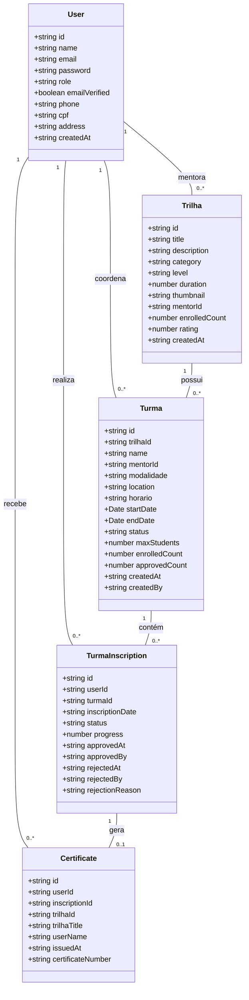
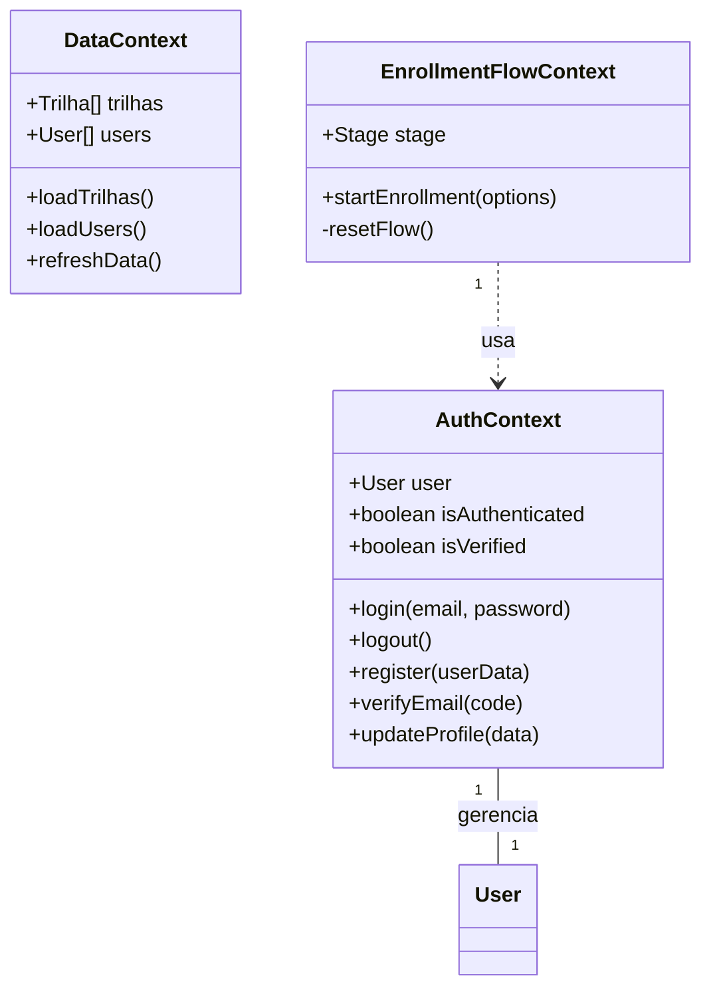
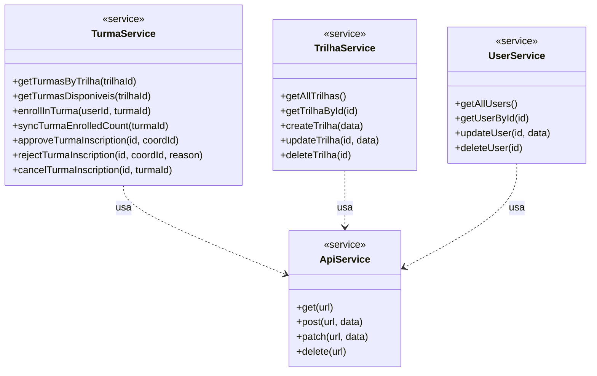
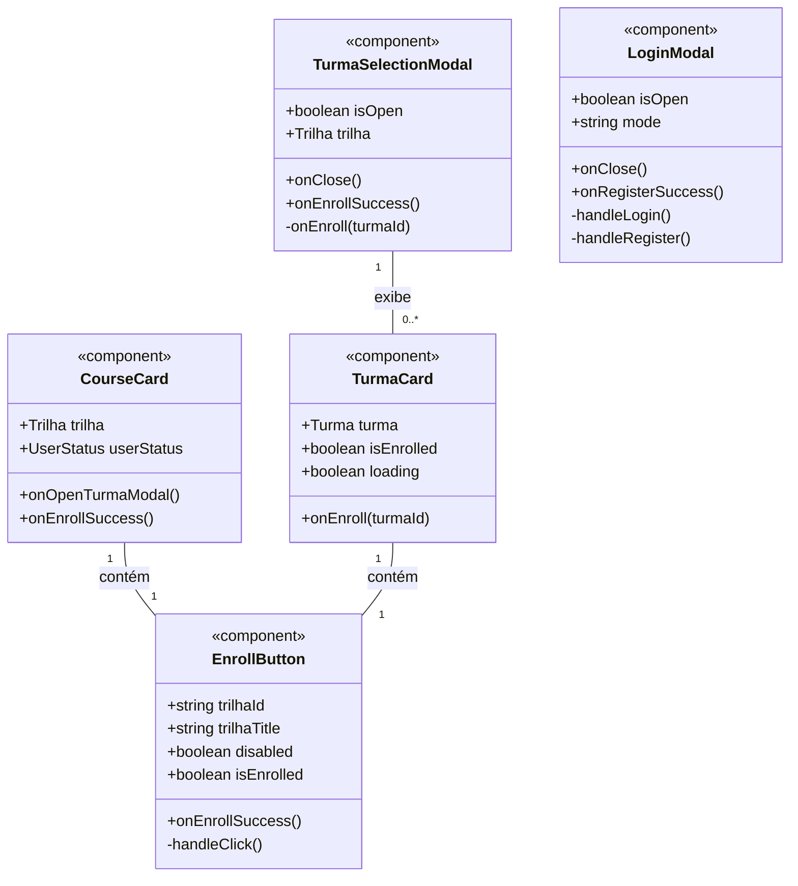
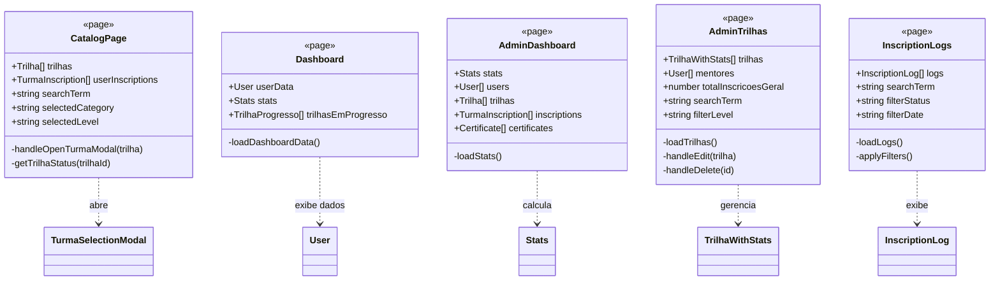
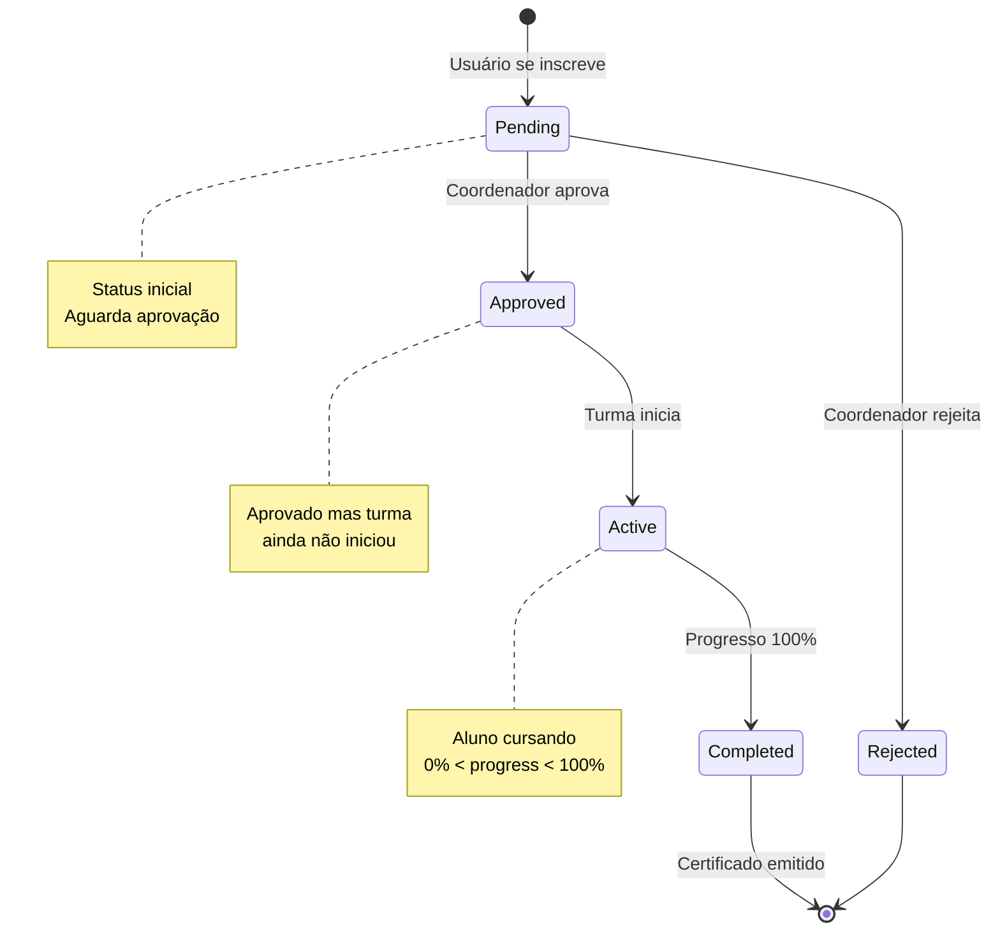
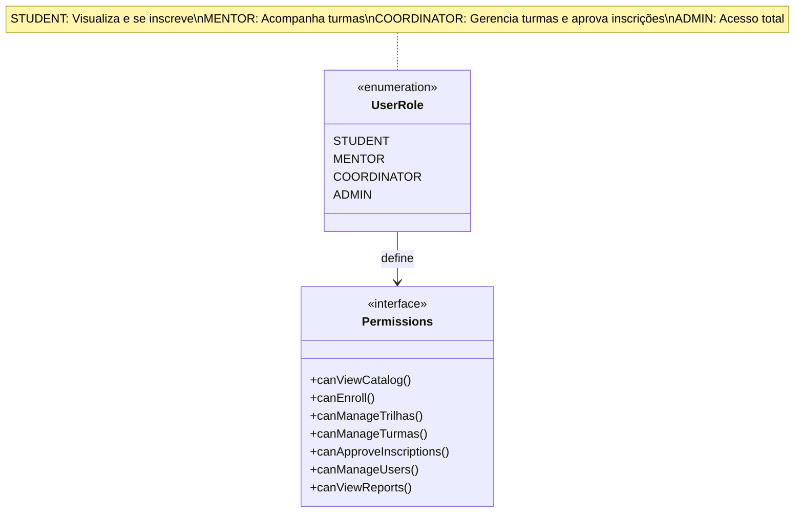
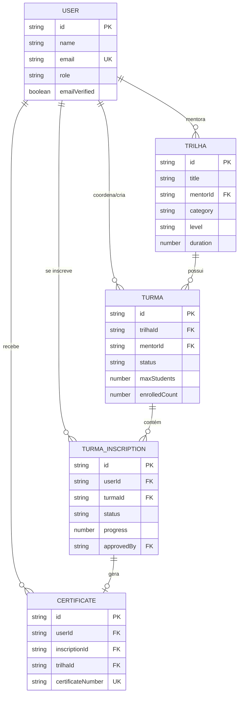

# Diagrama de Classes - Portal de Trilhas Educacionais

## Visão Geral da Arquitetura

Este documento apresenta o diagrama de classes do sistema de gerenciamento de trilhas educacionais.

## Diagrama de Classes Principal

## Diagrama de Contextos React

## Diagrama de Serviços (Services)

## Diagrama de Componentes Principais

## Diagrama de Páginas (Views)

## Fluxo de Estados de Inscrição

## Hierarquia de Roles

## Relacionamentos de Dados

## Padrões de Projeto Utilizados

### 1. **Context API Pattern**
- `AuthContext`: Gerenciamento global de autenticação
- `DataContext`: Cache e compartilhamento de dados
- `EnrollmentFlowContext`: Orquestração do fluxo de inscrição

### 2. **Service Layer Pattern**
- Separação da lógica de negócio (services) da UI (components)
- `turma.service.ts`, `api.ts`, etc.

### 3. **Custom Hooks Pattern**
- `useAuth()`: Acesso ao contexto de autenticação
- `useData()`: Acesso aos dados globais
- `useEnrollmentFlow()`: Controle do fluxo de inscrição
- `useTurmas()`: Operações relacionadas a turmas

### 4. **Modal Controller Pattern**
- Modais globais controlados por contexto
- Fluxo sequencial: Login → Verification → Enrollment

### 5. **Sync Pattern**
- `syncTurmaEnrolledCount()`: Sincronização automática de contadores

## Observações Técnicas

### Contagem de Inscrições
O sistema utiliza duas métricas:
- **enrolledCount** (por turma): Quantidade de vagas ocupadas (pending + approved + active + completed)
- **totalInscricoes** (por trilha): Usuários únicos inscritos em turmas da trilha

### Estados de Inscrição
1. **pending**: Aguardando aprovação do coordenador
2. **approved**: Aprovada, aguardando início da turma
3. **active**: Cursando (turma em andamento)
4. **completed**: Concluída (progress = 100%)
5. **rejected**: Rejeitada pelo coordenador

### Sincronização de Dados
- `enrolledCount` é sincronizado automaticamente após cada operação
- Inscrições rejeitadas não contam nas vagas
- Sistema auto-corrige inconsistências

---

**Última atualização**: 6 de novembro de 2025
